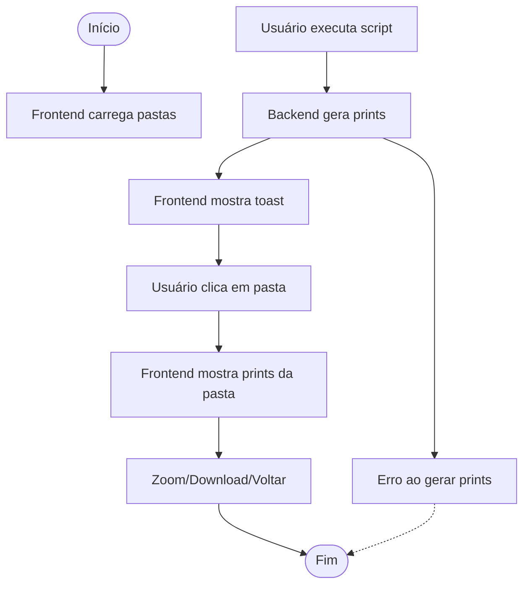

### Fluxograma Visual (Mermaid)



# Projeto Prints Einstein

Automação de prints das páginas de cursos Einstein, com backend Node.js/Express, automação Puppeteer e frontend dinâmico para visualização e download dos prints.

## Funcionalidades

- **Automação de Prints**: Gera prints das páginas de cursos Einstein,usando Puppeteer.
- **Organização por Data**: Prints são salvos em pastas nomeadas por data e local (ex: `Neuro_Rj_2025-09-15`).
- **Backend Centralizado**: Servidor Express com rotas para gerar prints, listar pastas e imagens, e servir arquivos estáticos.
- **Frontend Dinâmico**:
  - Lista todas as pastas de prints disponíveis (por data e local).
  - Permite navegar entre pastas e visualizar os prints.
  - Opção de zoom e download individual de cada print.
  - Toast de sucesso ao gerar prints.
  - Navegação intuitiva entre pastas e imagens.
  - Persistência: prints e pastas permanecem visíveis mesmo após recarregar a página.
- **Organização de Código**:
  - CSS separado em `public/style.css`.
  - JS separado em `public/main.js`.
  - HTML limpo em `public/index.html`.
- **Material de Apresentação**:
  - Fluxograma profissional do projeto em `fluxograma_profissional_drawio.xml` (importável no draw.io).

## Estrutura de Pastas

```
Project-Prints/
├── Neuro_Rj.js
├── Neuro_Sp.js
├── server.js
├── package.json
├── public/
│   ├── index.html
│   ├── style.css
│   ├── main.js
│   ├── Neuro_Rj_2025-09-15/
│   └── Neuro_Sp_2025-09-15/
├── fluxograma_profissional_drawio.xml
└── README.md
```

## Como Usar

1. Instale as dependências:
   ```bash
   npm install
   ```
2. Inicie o servidor:
   ```bash
   node server.js
   ```
3. Acesse o frontend em [http://localhost:3000](http://localhost:3000)
4. Use os botões para gerar prints RJ/SP, navegar pelas pastas, visualizar, dar zoom e baixar prints.

## Fluxograma

O fluxograma do projeto está disponível em `fluxograma_profissional_drawio.xml` e pode ser importado no [draw.io](https://draw.io) para visualização e edição.

## Tecnologias Utilizadas

- Node.js
- Express
- Puppeteer
- HTML, CSS, JavaScript (frontend dinâmico)
- draw.io (fluxograma)

## Créditos

Desenvolvido por Bruno Monteiro

---
