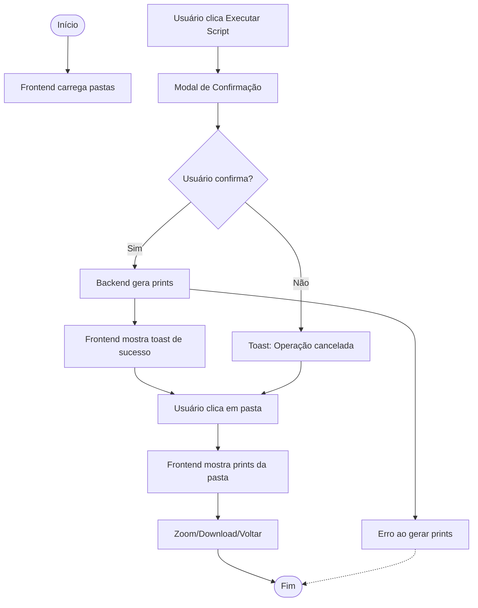

### Fluxograma Visual (Mermaid)



# Projeto Prints Einstein

Automação de prints das páginas de cursos Einstein, com backend Node.js/Express, automação Puppeteer e frontend SPA modularizado para visualização, execução e download dos prints.

## O que é SPA?

SPA (Single Page Application) é uma aplicação web que carrega uma única página HTML e atualiza dinamicamente o conteúdo conforme o usuário navega, sem recarregar a página inteira. Isso garante navegação rápida, fluida e experiência moderna para o usuário.

## Arquitetura do Projeto

### Frontend SPA Modularizado

- **index.js**: ponto de entrada, importa e inicializa todos os módulos, controla o fluxo SPA.
- **spa.js**: gerencia navegação SPA, alternância de views (home, cursos, subcursos, prints).
- **cards.js**: renderiza os cards dos cursos e subcursos, controla cliques e navegação entre níveis.
- **scripts.js**: executa scripts de automação (prints) e exibe os prints gerados.
- **utils.js**: funções utilitárias globais (toast de sucesso/erro, zoom nas imagens, helpers).

#### Fluxo SPA

1. **Home SPA**: exibe o card "Especialização Híbrida" centralizado.
2. **Cards dos Cursos**: ao clicar, mostra os seis cursos disponíveis. Cursos com subcursos (ex: Cuidados Paliativos) exibem cards dos subcursos.
3. **Execução de Scripts**: cada card de subcurso tem botão para executar o script de automação de prints (via backend). **Validação de Confirmação**: antes de executar, um modal de confirmação aparece perguntando se deseja criar novo semestre com prints (evita execuções acidentais).
4. **Visualização de Prints**: ao acessar uma pasta, os prints gerados são exibidos em grid horizontal responsivo, com opção de zoom e download.
5. **Toast**: toda ação relevante exibe toast de sucesso ou erro, global e sem duplicidade. Toast compacto e discreto com animação slide da direita para esquerda.

#### Estrutura de Pastas

- **public/**: arquivos estáticos do frontend (HTML, CSS, JS, imagens)
- **routes/**: rotas separadas por curso no backend (Node.js)
- **Cuidados_Paliativos_Quinzenal_Pratica_YYYY-MM-DD/**: pasta gerada automaticamente com prints do subcurso específico
- **Cuidados_Paliativos_Quinzenal_YYYY-MM-DD/**: prints da turma quinzenal
- **Cuidados_Paliativos_Semanal_YYYY-MM-DD/**: prints da turma semanal
- (Demais cursos seguem padrão de nomeação)

### Backend Modularizado

- **server.js**: ponto de entrada do backend, importa rotas de cada curso.
- **routes/**: cada curso tem seu próprio arquivo de rota, facilitando manutenção e expansão.
- **Automação Puppeteer**: scripts de automação para gerar prints das páginas dos cursos.

#### Como expandir

- Para adicionar novos cursos: crie um novo arquivo de rota em `routes/` e adicione o curso no array global do frontend.
- Para novos subcursos: adicione no array `subcursos` do curso correspondente no frontend.
- O frontend e backend estão preparados para receber novos cards, rotas e scripts sem duplicidade ou bagunça visual.

### Funcionalidades de Segurança e Validação

- **Modal de Confirmação**: antes de executar scripts de automação, um modal aparece perguntando confirmação para evitar execuções acidentais.
- **Toast Compacto**: notificações discretas com animação slide da direita para esquerda, sem ocupar muito espaço na tela.
- **Validação de Conteúdo**: scripts verificam se elementos estão visíveis antes de capturar screenshots.
- **Tratamento de Erros**: captura robusta com fallbacks para garantir que scripts continuem mesmo com falhas pontuais.
- **Timing Otimizado**: delays ajustados para garantir que elementos estejam completamente carregados antes da captura.

### Boas Práticas e Organização

- Separação clara entre frontend e backend.
- Modularização dos arquivos JS no frontend para facilitar manutenção e expansão.
- SPA garante navegação fluida, visual moderno e experiência consistente.
- Toast global, sem duplicidade, para feedback ao usuário.
- Estrutura de pastas organizada para fácil localização de prints e scripts.

### Exemplo de Estrutura

```
Project-Prints/
├── server.js
├── package.json
├── public/
│   ├── index.html
│   ├── style.css
│   ├── main.js
│   ├── spa.js
│   ├── cards.js
│   ├── scripts.js
│   ├── utils.js
│   ├── index.js
│   └── Cuidados_Paliativos_Quinzenal_2025-09-15/
├── routes/
│   ├── cuidadosPaliativos.js
│   └── ...
├── fluxograma_profissional_drawio.xml
└── README.md
```

## Como Usar

1. Instale as dependências:
   ```bash
   npm install
   ```
2. Inicie o servidor:
   ```bash
   node server.js
   ```
3. Acesse o frontend em [http://localhost:3000](http://localhost:3000)
4. Use os botões para gerar prints, navegar pelas pastas, visualizar, dar zoom e baixar prints.

## Fluxograma

O fluxograma do projeto está disponível em `fluxograma_profissional_drawio.xml` e pode ser importado no [draw.io](https://draw.io) para visualização e edição.

## Tecnologias Utilizadas

- **Node.js**: Backend JavaScript
- **Express**: Framework web para Node.js
- **Puppeteer**: Automação de browser para captura de screenshots
- **HTML, CSS, JavaScript**: Frontend SPA modularizado
- **draw.io**: Fluxograma visual do projeto

## Funcionalidades Implementadas

- **Automação Inteligente**: Captura automática de screenshots com tratamento de erros
- **Modal de Confirmação**: Validação antes de executar scripts para evitar execuções acidentais
- **Toast Notifications**: Notificações discretas com animação slide
- **Layout Padronizado**: Botões e elementos com design consistente
- **Captura de Modais**: Suporte especial para capturar modais (ex: Modalidades de Ensino)
- **Scroll Inteligente**: Posicionamento automático para evitar headers indesejados
- **Tratamento de Cookies**: Remoção automática de banners de cookies
- **Fallback Robusto**: Scripts continuam funcionando mesmo com falhas pontuais

## Créditos

Desenvolvido por Bruno Monteiro

---

```
Project-Prints/
├── Neuro_Rj.js
├── Neuro_Sp.js
├── server.js
├── package.json
├── public/
│   ├── index.html
│   ├── style.css
│   ├── main.js
│   ├── Neuro_Rj_2025-09-15/
│   └── Neuro_Sp_2025-09-15/
├── fluxograma_profissional_drawio.xml
└── README.md
```

## Como Usar

1. Instale as dependências:
   ```bash
   npm install
   ```
2. Inicie o servidor:
   ```bash
   node server.js
   ```
3. Acesse o frontend em [http://localhost:3000](http://localhost:3000)
4. Use os botões para gerar prints RJ/SP, navegar pelas pastas, visualizar, dar zoom e baixar prints.

## Fluxograma

O fluxograma do projeto está disponível em `fluxograma_profissional_drawio.xml` e pode ser importado no [draw.io](https://draw.io) para visualização e edição.

## Tecnologias Utilizadas

- Node.js
- Express
- Puppeteer
- HTML, CSS, JavaScript (frontend dinâmico)
- draw.io (fluxograma)

URL's Prints

cuidados_paliativos
https://ensino.einstein.br/pos_cuidados_paliativos_p0081/p?sku=10690&cidade=sp - unidade paulista | Quinzenal Pratica estendida

https://ensino.einstein.br/pos_cuidados_paliativos_p0081/p?sku=10691&cidade=sp - unidade paulista | Quinzenal

https://ensino.einstein.br/pos_cuidados_paliativos_p0081/p?sku=10693&cidade=sp - unidade paulista | Semanal

https://ensino.einstein.br/pos_cuidados_paliativos_p0081/p?sku=10923&cidade=rj - unidade rio de janeiro | Mensal

https://ensino.einstein.br/pos_cuidados_paliativos_p0081/p?sku=10939&cidade=go - unidade goiânia | Mensal

dependencia_quimica
https://ensino.einstein.br/pos_dependencia_quimica_p5174/p?sku=10697&cidade=sp - Unidade CEP | Mensal

sustentabilidade*lider_inovacao*
https://ensino.einstein.br/pos_gt_sustentabilidade_lider_inovacao_esg_p14832/p?sku=10118&cidade=sp - Unidade Paulista II | Mensal

infraestrutura_facilities_saude
https://ensino.einstein.br/pos_gt_infraestrutura_facilities_saude_p14827/p?sku=9305&cidade=sp - Unidade Paulista II | Mensal

psiquiatria_multiprofissional
https://ensino.einstein.br/pos_psiquiatria_multiprofissional_p4542/p?sku=10771&cidade=sp - Unidade Paulista | Mensal

bases_saude_integrativa_bem_estar
https://ensino.einstein.br/pos_bases_saude_integrativa_bem_estar_p0078/p?sku=10685&cidade=sp - Unidade Paulista | Mensal

## Créditos

Desenvolvido por Bruno Monteiro

---
